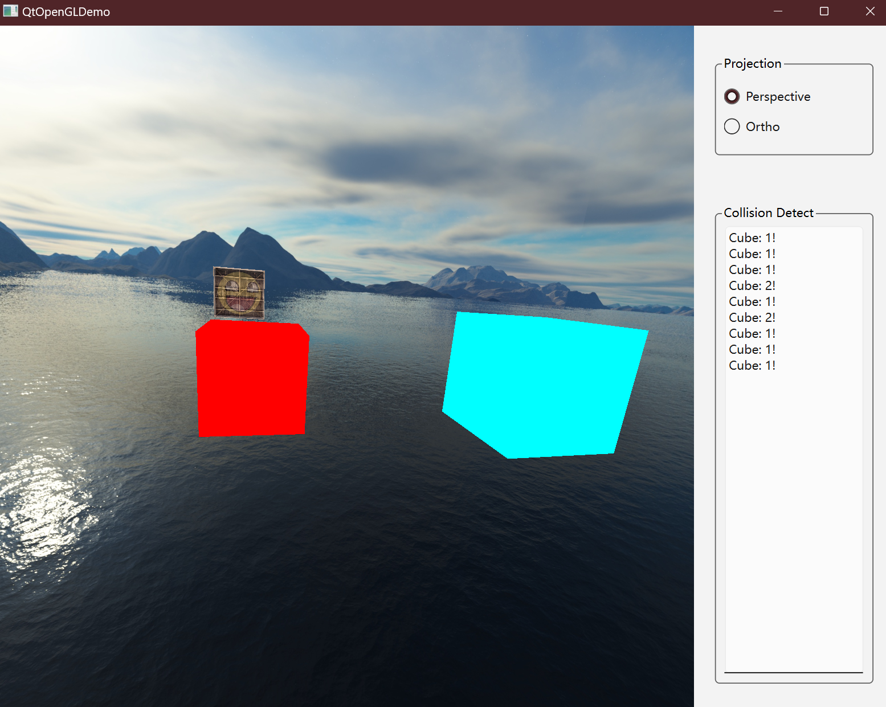
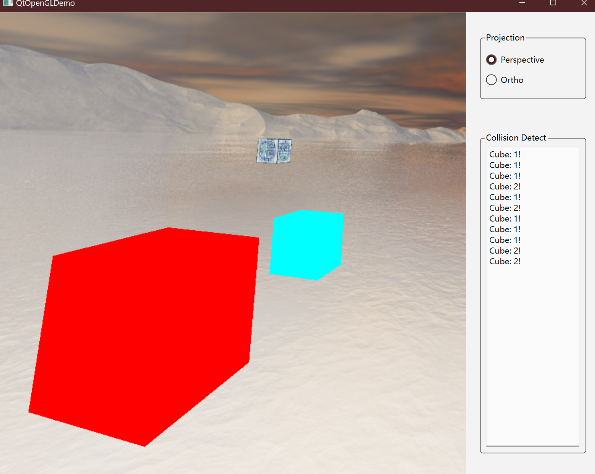
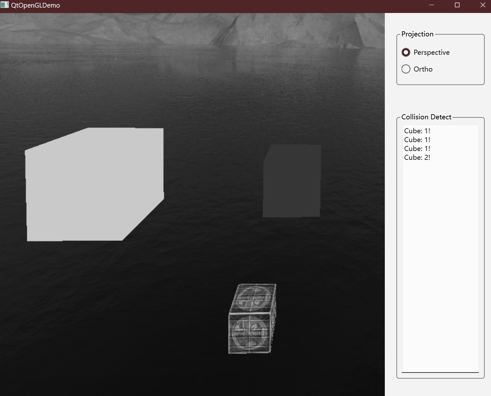

# 图形学作业二
王展鹏 2020010876
## 实验目的
1. 构建场景
2. 场景漫游
3. 碰撞检测
4. 滤镜
## 实验方法
1. 构建场景
  - 天空盒：使用立方体贴图实现天空盒，移除位移，并将其深度设为最大
  - 两个静态三维物体：两个位置、大小、颜色均不同的立方体，使用纯色材质
  - 一个动态三维物体：一个附带纹理的立方体，在一定空间范围内以恒定速度移动
  - 支持场景配置文件读入：使用json文件配置场景中的物体位置、大小、角度、颜色信息和画面滤镜效果
2. 场景漫游
  - 使用鼠标拖动实现视角旋转
  - 使用键盘WASD实现视角的上下左右移动
  - 使用键盘FB实现视角的前后移动
  - 使用键盘ZX实现视角的缩放
3. 碰撞检测
  - AABB方法检测碰撞：判断两个物体的AABB包围盒是否相交，同时判断碰撞面方向
  - 碰撞后物体反弹：碰撞后物体和以镜面反射的方式反弹，通过碰撞面方向和物体速度方向计算反弹速度
  - 碰撞时UI界面提示：在窗口右侧文本显示框中显示碰撞提示信息
4. 使用帧缓冲实现滤镜
  - 帧缓冲实现：使用帧缓冲将场景渲染到纹理上，再将纹理渲染到屏幕上
  - 滤镜效果：通过着色器配置，实现了反色、灰度两种滤镜效果
## 实验结果
1. 场景和物体碰撞检测



2. 配置文件示例

    ```json
    {
        "cube1": {
            "size": 2,
            "position": [-2.0, 0.0, 0.0],
            "rotation": [0.0, 0.0, 0.0],
            "color": [1.0, 0.0, 0.0]
        },
        "cube2": {
            "size": 3,
            "position": [5.0, 0.0, 0.0],
            "rotation": [0.0, 0.0, 0.0],
            "color": [0.0, 1.0, 1.0]
        },
        "cube": {
            "velocity": [7.0, 4.0, 6.0]
        },
        "filter": "gray" 
    }
    ```
3. 滤镜效果
- 反色滤镜



- 灰度滤镜



## 编译环境
- Windows 11 23H2
- VScode 1.95.3 
  - Qt C++ Extension 1.0.0
  - CMake 3.29.2 Extension
- Qt 6.7.3 (MinGW 11.2.0 64-bit)

## 编译方式
- 使用VScode打开项目文件夹
- 使用Qt C++插件配置Qt版本
- 使用CMake插件配置编译环境
- 使用CMake工具编译项目

## 参考资料
- [LearnOpenGL CN](https://learnopengl-cn.github.io/)